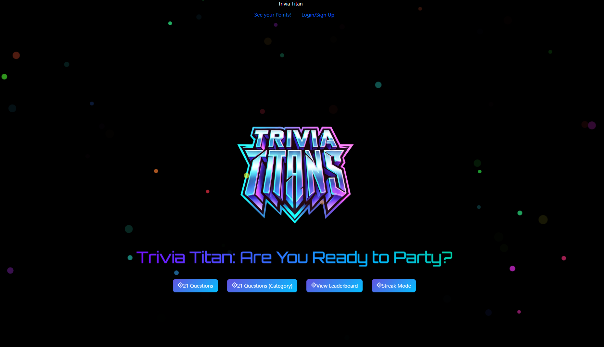
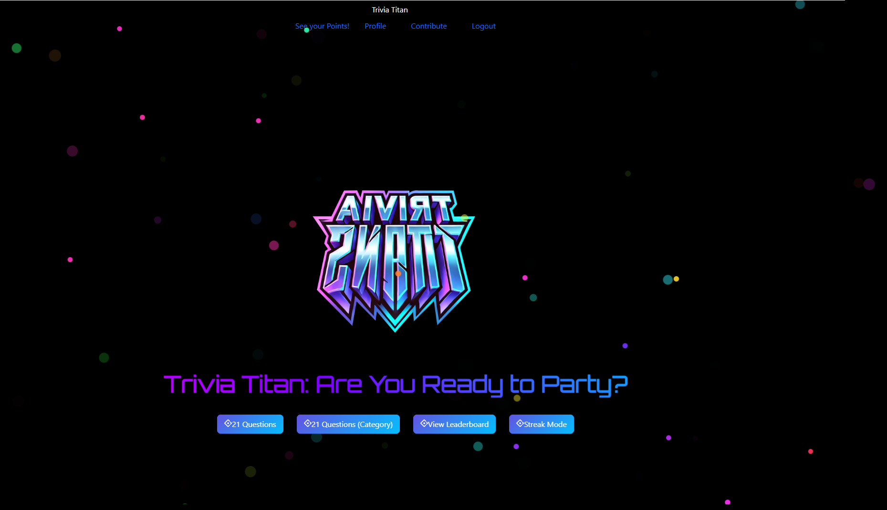

# Trivia Titans

## Description
Triva Titans allows a user to test their triva knowledge in one of our three modes, 21 questions, infinite streak, 21 questions by category. The Quizmania api is used to generate questions for the user. When the user is loged in they are able to edit their profile, access the contribute page, and view the leaderboard. JWT encryption is used to protect user passwords and to authenticate users on the database.

## Table of Contents
- [Features](#features)
- [Installation](#installation)
- [Usage](#usage)
- [Github Link](#github-link)
- [screenshot](#screenshot)
- [3 Game Modes](#3-game-modes)
- [User Authentication and Data Security](#user-authentication-and-data-security)
- [Contributing](#contributing-and-Credits)
- [License](#license)
- [Tests](#tests)
- [Questions?](#questions)

## Features
Profile Editing
- Users can input changes to their profile such as changing their username and password.
Contribute forms
- Two forms on the contribute page to submit your own question with answers and to submit general feedback
3 game modes
- Users can select from 3 game modes 21 questions, streak, and 21 questions by catagory.
User Authentication and Security
- Secure login with JWT ensures user data privacy and personalized access to highscore.
Mobile and Desktop Responsiveness
- Designed for both mobile and desktop for a seamless user experience across devices.
Explanation of answers
- Users recieve an explanation of the answer regardless of whether they got the question right or wrong.

## Technologies Used
Frontend
- React: For building the interactive and responsive user interface.
Backend
- GraphQl and MongoDB for apis and DB managment.
- JWT (JSON Web Tokens): For secure user authentication.
- Apollo server
APIs
- Quizmania API: provides the questions, answers, and explanation.

## Installation

- git clone the repository
- npm/yarn i in the root directoty

## Usage
To use run
- npm/yarn run build in the root directoty
- npm/yarn run start:dev in the root directoty to launch in developer mode

# Github Link

https://github.com/kyand38/Trivia-Titans.git

##  screenshot

  

  

## 3 Game modes

As a user, I want to play a trivia game.

21 questions standard
- When the user is taken to the game page they see a button to gereate their first question.
- After answering a question the score is edited acording to if they got the question right.
- The game ends when 21 questions have been answered.

Streak mode
- The same rules as 21 question except the game ends when the user gets a question wrong.

21 questions by catagory
- the same rules as 21 questions standard but the user must interact with a modal to select a category for their trivia.

## User Authentication and Data Security
As a user, I want my personal information and highscore to be secure, so I can feel confident my data is protected.

JWT Authentication for Access Control
- Users are required to log in to access and modify their aurora log. The app uses JWT to verify authenticated sessions, ensuring only authorized users can access protected data.

Secure Environment Variable Management
- All API keys, JWT secrets, and sensitive information are stored securely in environment variables, keeping the app secure and safeguarding external API keys and user information.

Data Privacy Assurance
- User data is protected per best practices in data security, including the encryption of passwords and restriction of access to personal logs to authenticated sessions only.

## Contributing and Credits
[Trinigch](https://github.com/Trinigch)

[MrBalld](https://github.com/MrBalld)

[kyand38](https://github.com/kyand38)

[JoshAskew](https://github,com/JoshAskew)

Contributions are welcome! Feel free to open issues or submit pull requests to improve this project Feedback can also be given on the contribute page.

## License
This application is covered under the following license: [MIT License](https://www.gnu.org/licenses/gpl-3.0)

## Questions?
 If you have any questions, feel free to contact us:

- [GitHub: Trinidad Peterson](https://github.com/trinigch)
- [GitHub: Josh Askew](https://github.com/JoshAskew)
- [GitHub: Devan Ballantine](https://github.com/MrBalld)
- [GitHub: Kyle Anderson](https://github.com/kyand38)
